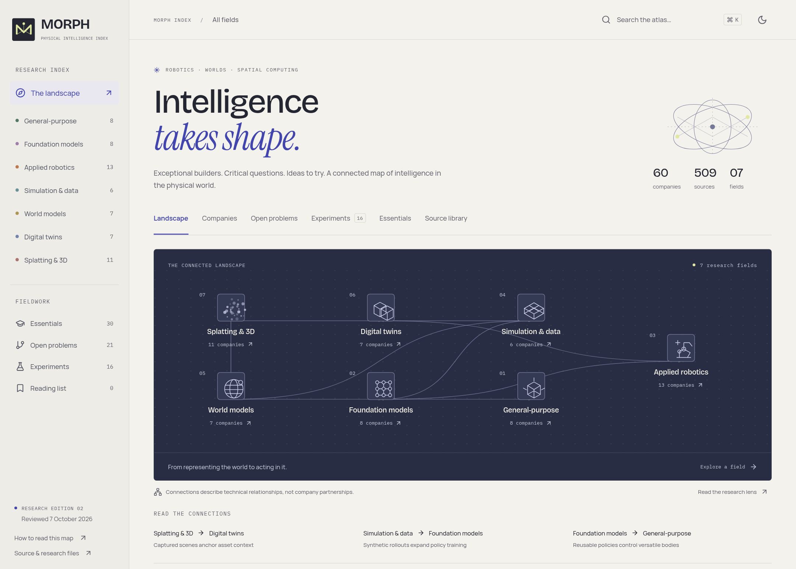
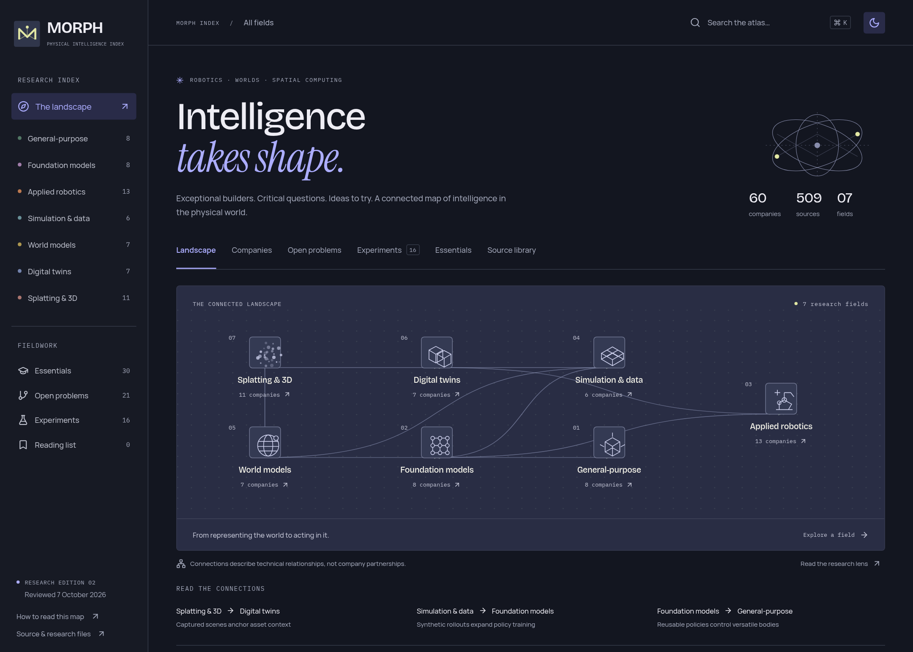

# MORPH

**The physical intelligence index.**

A research map for understanding the companies and technologies bringing intelligence into the physical world. Find interesting builders, see how their work connects, and follow the evidence into papers, code, demos, and practical experiments.

[Explore MORPH](https://robotics-map-puce.vercel.app) · [Essential reading](https://robotics-map-puce.vercel.app/#resources) · [Research notes](research/AUDIT.md)

The hosted site currently requires Vercel sign-in.



<details>
<summary>See the dark theme</summary>



</details>

**Edition 02 · reviewed 7 October 2026**

| Companies | Open problems | Experiments | Essential resources | Sources |
| :-------: | :-----------: | :---------: | :-----------------: | :-----: |
|  **60**   |    **21**     |   **16**    |       **30**        | **509** |

## How the fields connect

Robotics depends on more than a robot. It needs ways to represent the world, predict what happens, learn useful skills, and test those skills before deployment. This is the map MORPH uses to connect those pieces.


[Open the full-size map](docs/assets/landscape.png) · [Vector version](docs/assets/landscape.svg)

Arrows show how technologies can support one another. They do not imply company partnerships, working integrations, or proven transfer from simulation to reality. A convincing reconstruction is not automatically a physical twin; a plausible generated future is not automatically a reliable plan.

| Field                                  | The question worth asking                                |
| -------------------------------------- | -------------------------------------------------------- |
| General-purpose robotics               | Can one body become a reliable worker across many tasks? |
| Robotics foundation models             | What transfers when the robot, task, or room changes?    |
| Applied robotics                       | Where does autonomy already create measurable value?     |
| Simulation & synthetic data            | Which simulated successes survive contact with reality?  |
| World models                           | Does the imagined future remain useful for action?       |
| Digital twins                          | Can the model stay connected to the asset it represents? |
| Gaussian splatting & 3D reconstruction | When does a convincing view become usable geometry?      |

## A few ways in

Start with the [landscape](https://robotics-map-puce.vercel.app/#overview) to get your bearings. Open a field to meet its companies, then follow a profile into the problems, experiments, and resources connected to it.

- **Find a builder.** Browse [companies](https://robotics-map-puce.vercel.app/#companies), or use **New bearings** for the 24 additions in this edition. Filter by field, subcategory, tag, or evidence stage.
- **Understand the hard part.** The [open problems](https://robotics-map-puce.vercel.app/#problems) explain what remains unsolved and why it matters.
- **Try something.** [Experiments](https://robotics-map-puce.vercel.app/#experiments) include a build idea, useful controls, evaluation metrics, and estimated hardware needs.
- **Build a foundation.** [Essentials](https://robotics-map-puce.vercel.app/#resources) is a short, curated syllabus of things to read, watch, build, or follow.

The syllabus has three starting paths:

| Path                                                                            | What you will explore                                     |
| ------------------------------------------------------------------------------- | --------------------------------------------------------- |
| [Teach a body](https://robotics-map-puce.vercel.app/#resources?path=act)        | Control, data, policies, and real-world evaluation        |
| [Model a world](https://robotics-map-puce.vercel.app/#resources?path=predict)   | Dynamics, prediction, and models connected to real assets |
| [Capture a space](https://robotics-map-puce.vercel.app/#resources?path=capture) | Geometry, radiance, reconstruction, and their limits      |

Save anything worth revisiting to your reading list. Bookmarks stay in your browser; profile and reading-path links can be shared.

Click the moon in the header to switch between light and dark. The site starts with your device's appearance and remembers your choice in this browser.

## What is in a company profile?

The cards give you the actual job and the technical edge. Open one for the approach, the problem it solves, evidence of traction, and the limits of what has been demonstrated. Sources link directly to the relevant papers, repos, technical posts, demos, reporting, and discussions.

**Founders & contact** keeps role evidence separate from contact evidence, so you can see who a person is and where their public route was found. All 60 companies have sourced founder, founding-team, or operator routes. There are 19 explicitly published individual professional emails; company inboxes and forms are labeled separately. No addresses were guessed, and inbox delivery or replies were not tested.

## How the research is handled

Selection matters more than count. Entries earn their place through a distinctive technical approach, a valuable problem, or evidence worth examining. The sources and limitations stay close to the claim.

- Primary papers, code, company material, and customer evidence support technical and factual claims. Company-reported results remain attributed.
- X and Reddit help discover work and understand practitioner experience. Access-restricted posts are labeled and are not used as unread proof.
- A demo, pilot, product, and deployment are different stages. Announced agreements and reported funding remain qualified when independent confirmation is missing.
- Experiments are researched proposals, not results from runs on robots or GPUs. Time and compute estimates, licenses, and version limits are included where relevant.

This is an editable research snapshot, not an automatically updated feed. Dates matter. See the [audit](research/AUDIT.md) and the [research notes](research/) for source checks, exclusions, and corrections.

## Run it locally

Use **Node.js 22.12+ or 24** and npm. Production uses Node.js 24.

```sh
# The site currently lives on the work branch.
git clone --branch work https://github.com/preetchangede/robotics_map.git
cd robotics_map
npm ci
npm run build
npm run dev
```

Open the URL printed by Vite. The build prepares the research data, validates it, and creates the production files in `dist/`. To serve that build, run `npm run preview`.

## Update the map

Edit the source files in `research/`, then run `npm run build`. Avoid hand-editing the generated `src/data/atlas.json`.

| Files                                                                          | What belongs there                                          |
| ------------------------------------------------------------------------------ | ----------------------------------------------------------- |
| `robotics-models.json`, `niche.json`, `simulation-worlds.json`, `spatial.json` | Original company profiles                                   |
| `expansion-*.json`                                                             | The selected company additions                              |
| `updates-*.json`                                                               | Refinements to existing entries, matched by ID              |
| `contacts-*.json`                                                              | Founder roles, public routes, provenance, and access status |
| `resources-*.json`                                                             | Essential reading, watching, building, and following        |
| `problems.json`, `experiments.json`                                            | Critical questions and proposed experiments                 |
| `taxonomy.json`, `relationships.json`                                          | Subcategories and related entries                           |
| `editorial.json`                                                               | Concise card copy for the original profiles                 |
| `*-notes.md`, `AUDIT.md`                                                       | Source reads, exclusions, verification, and review dates    |

For a new edition, recheck company status, founder roles, contact routes, and claim-critical sources. Keep a performance claim attached to its task, dataset, date, and intervention policy. Update review dates and edition labels together.

After research edits, rebuild before running the development server, or run `node scripts/prepare-data.mjs` to refresh the generated data.

## Check a change

```sh
npm run build
npm run audit
```

The data audit checks IDs, URLs, evidence, founder provenance, and relationships. It does not fetch every external link. Link availability and the claims behind them need a research review.

For the browser audit, keep `npm run dev` running in one terminal, then use another:

```sh
npm test
```

It uses Chromium at `/usr/bin/chromium` and the site at `http://localhost:5173`. Override these with `ATLAS_CHROMIUM_PATH` and `ATLAS_BASE_URL` if needed. Results and screenshots go into ignored `.qa/`.

Edition 02 passed 30 browser checks, including 11 axe accessibility scans. These cover navigation, filters, browser Back, bookmarks, founder provenance, reading paths, deep links, keyboard focus, and mobile layouts. Automated scans cover the tested states; they are not an accessibility certification.

## Design and hosting

MORPH uses an original geometric M mark, warm paper, ink, indigo, and small citron accents. Bricolage Grotesque, Manrope, Instrument Serif, and IBM Plex Mono provide the typography. Fonts are self-hosted; their [licenses](public/font-licenses.txt) are included.

The app is React + Vite, deployed to the existing Vercel `robotics-map` project. Research ships with the static site. The UI, vendor, and research bundles are cached separately; there are no paid API or runtime-secret requirements.

For deployment, install with `npm ci`, build with `npm run build`, and publish `dist/`. `vercel.json` handles SPA routes and caching. Verify the reviewed commit and production assets after deploying, and preserve the existing sign-in protection.

The README's [visual map](docs/assets/landscape.svg) is an editable SVG. The [site](https://robotics-map-puce.vercel.app) has the interactive version, with field filters and related research a click away.
